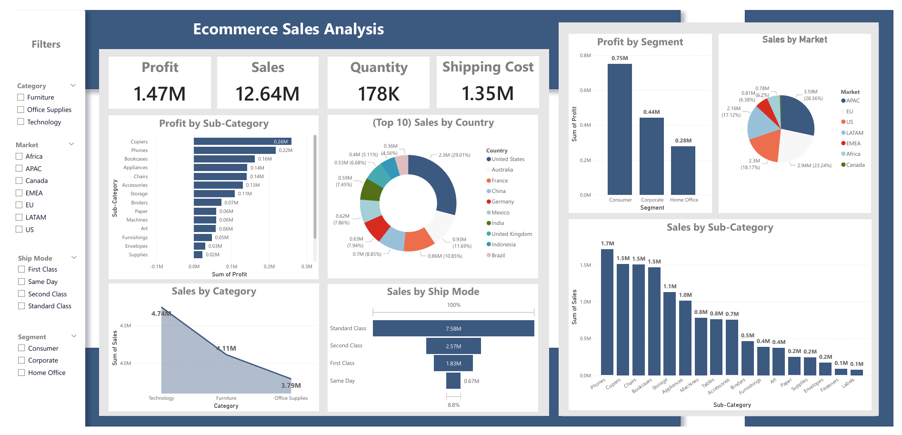

📊 Dashboard Overview
Your Power BI dashboard presents a comprehensive analysis of eCommerce performance by combining:
- 🧮 Sales Metrics – total revenue, average order value, top products by quantity and revenue
- 👥 Customer Behavior – retention levels, high-value customers
- 📦 Product & Category Performance – revenue by category, low-selling products
- 📈 Trend Analysis – month-over-month growth, seasonal sales patterns
- 🗺️ Geographic Insights – sales concentration by region or city
This dashboard helps stakeholders monitor growth, assess inventory health, and identify revenue drivers at a glance.

🚨 Problems Identified
- Low Repeat Purchase Rate: A majority of customers purchase only once, showing weak loyalty and retention.
- Uneven Product Performance: Top 5 products dominate revenue, while many SKUs contribute minimally.
- Seasonal Sales Volatility: Clear spikes during festive periods, followed by drastic dips.
- Campaign Ineffectiveness: Certain promotional campaigns failed to generate expected traction or conversions.
- Inventory Overload: Some underperforming items remain in stock for too long, affecting cash flow.

💡 Key Insights from the Dashboard
- 📊 Monthly Sales Trend shows Q4 dominance (Oct–Dec), likely driven by festive shopping, while April–June slumps reveal poor off-season performance.
  
- 🛒 Average Order Value (AOV) stabilizes around ₹1200, indicating customers tend toward mid-value purchases.
- 👑 Top Customers account for a large share of revenue—targeting this segment could drive quick wins.
- 🚚 Tier-1 Cities lead in revenue, suggesting urban-centric demand and market opportunity.
- 📉 Bottom 5 Products contribute less than 5% of revenue despite high listing frequency.

🛠️ Solutions & Suggestions

--- Improve Customer Retention ---

- Launch loyalty programs offering points, discounts, or early access.
- Segment customers and send personalized follow-ups or product recommendations.
- Implement referral rewards to incentivize repeat interactions.
  
--- Revamp Underperforming Products ---

- Use bundling strategies to increase exposure of slow-moving SKUs.
- Adjust pricing based on competitor benchmarks or perceived value.
- Retire products with consistently low sales or optimize product descriptions and placement.
  
--- Reduce Revenue Dependency ---
  
- Promote mid-tier and new products via targeted email campaigns and homepage slots.
- Highlight user-generated reviews for underexposed items to build trust.
- Introduce limited-time offers for low-contributing SKUs to boost short-term demand.

--- Stabilize Sales Volatility ---

- Build seasonal content calendars around peak months with early-bird marketing.
- Use predictive analysis to anticipate demand and adjust ad spend accordingly.
- Create evergreen campaigns for low-activity periods to maintain revenue baseline.

--- Optimize Marketing Efficiency ---
  
- Conduct A/B testing for campaign creatives, formats, and timing.
- Monitor CTR and conversion metrics per channel (social, email, paid ads).
- Invest in retargeting ads for cart abandoners and high-engagement visitors.
  
 --- Streamline Inventory Strategy ---
 
- Run sell-through analysis to identify stock velocity per SKU.
- Set automatic markdowns for aging inventory in Power BI using DAX formulas.
- Align procurement volume with seasonal forecasting to reduce overstock risk.

